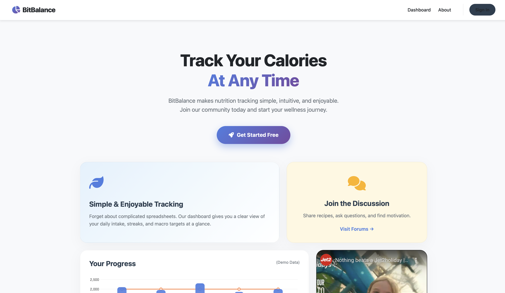
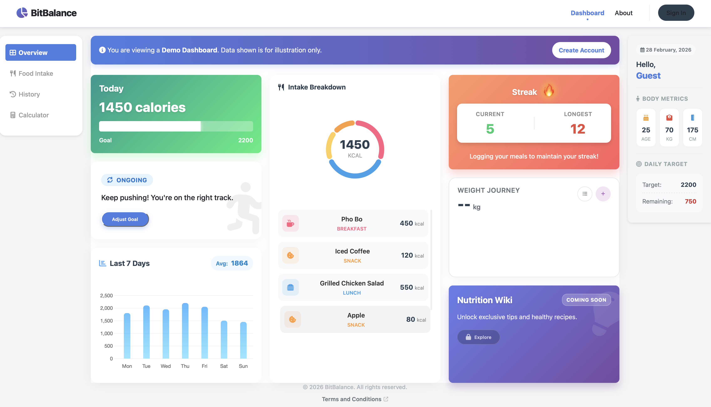
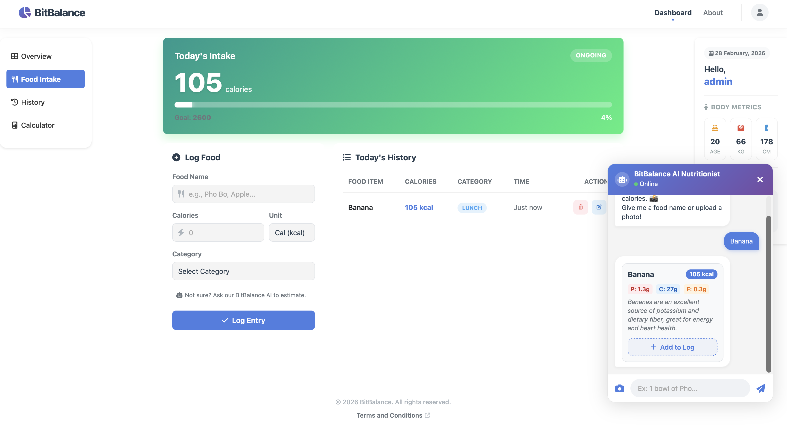
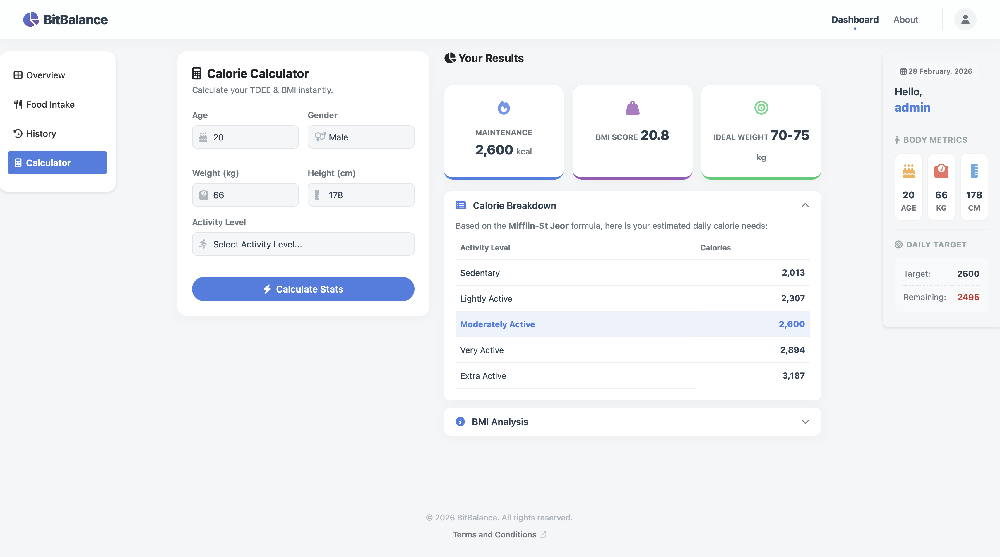

# BitBalance – AI-Assisted Calorie Tracking Platform

BitBalance is a modular full-stack web application designed to help users track daily calorie intake, manage nutrition goals, and monitor progress over time.

The system integrates AI-powered food image analysis via Gemini API and includes multi-role access control (User/Admin), forum interaction, and product management features.

⚠️ To enable AI functionality, add your own Gemini API key in db_config.php.

---

# 🚀 System Overview

BitBalance is structured into modular backend components to separate concerns and maintain scalability:
	•	Authentication Module – Session-based login with password hashing
	•	Calorie Tracking Module – Intake logging and daily goal management
	•	AI Integration Module – Image processing and calorie extraction
	•	Admin Module – User, system log and content management (Work in progress)

Database communication is handled using PDO with prepared statements to prevent SQL injection.

# 🏗 Architecture Design

The application follows a structured backend approach:
	•	Separation of authentication, business logic, and database operations
	•	Modular file organization for maintainability
	•	Relational database schema with clear entity relationships
	•	Role-based session validation (User vs Admin)


# 🔐 Security Considerations
	•	Password hashing for user authentication
	•	Session-based access control
	•	PDO prepared statements to prevent SQL injection
	•	Basic input validation and sanitization

# ✨ Features
	•	User registration and login
	•	AI-assisted calorie estimation from food images
	•	Calorie intake logging with 7-day progress chart
	•	Set and update daily calorie goals
	•	CRUD operations for intake records
	•	Forum with posts, comments, and likes
	•	Product listing with basket functionality
	•	Admin dashboard for user and content management
	•	Responsive UI


## Tech Stack

- **Frontend:** HTML, CSS, JavaScript
- **Backend:** PHP (PDO for MySQL)
- **Database:** MySQL
- **Tools:** XAMPP (for local development)
- **Version control:** Git, GitHub

## Setup & Installation

1. **Clone this repo**
    ```bash
    git clone https://github.com/rmit-computing-technologies/prototype-milestone-2-group_20_wps_2025.git
    ```

2. **Import the Database**
    - Use `phpMyAdmin` or the MySQL CLI to import the provided SQL files from `include/` (if available).
    - Make sure your MySQL user and password are set in `db_config.php`.

3. **Configure Environment**
    - Edit `db_config.php` with your local database credentials.
	- For Gemini AI in Dashboard Intake Usage, use your own API Key and create `include/secrets.php` with content as follows:
	    
	```bash
	<?php
	// Gemini API key (this should be kept secret in a real application, but is included here for demonstration purposes)
	// Should be put in .env file in production
	define('GEMINI_API_KEY', 'EXAMPLE_API_KEY');
	?>
    ```

4. **Run Locally**
    - Place the project in your local web server’s directory (e.g. `htdocs` for XAMPP).
    - Visit `http://localhost/BitBalance-2.0---Calorie-Tracker/` in your browser.
    - Visit `http://localhost/BitBalance-2.0---Calorie-Tracker/admin/admin.php` (for admin pages)

---

## Test Account


You can create your own account, the sign-up and sign-in processes are fully functional, and your password is securely hashed.

Easy Admin:
admin@gmail.com
admin123

## Usage

- **Sign Up** for an account or log in (User). 
- **Admin Sign Up**, visit `http://localhost/BitBalance-2.0---Calorie-Tracker/admin/admin-signup.php` (For demo purposes only)
- **Set your daily calorie goal** via the Dashboard.
- **Add food intake** on the Intake page.
- **View your weekly progress** with dynamic charts.
- **Admins** can access admin tools via `/admin/admin.php`.

## License

This project is for educational purposes.  
MIT License.

## Screenshots


**BitBalance Homepage**


**BitBalance Dashboard**


**BitBalance Dashboard Intake**


**BitBalance Dashboard Calculator**

---

## Contact

For any issues or questions, open a GitHub issue or contact [s3974781@rmit.edu.vn].